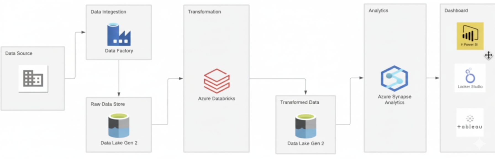
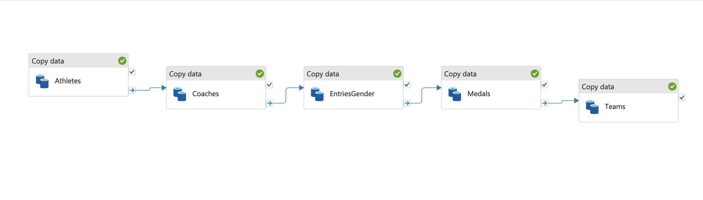

# 🧠 Azure Data Engineering ETL Pipeline — Tokyo Olympics Data
This project demonstrates an end-to-end Azure Data Engineering ETL pipeline built using Azure Data Factory, Azure Data Lake Gen2, and Azure Databricks. The pipeline ingests Tokyo Olympics datasets, transforms them in Databricks, and prepares the data for analytics in Azure Synapse Analytics and Power BI.

## 📊 Architecture Overview
The solution follows a modern Azure-based data engineering architecture:
1. Data Source → Raw CSV datasets (Tokyo Olympics data)
2. Azure Data Factory (ADF) → Ingests raw data into Azure Data Lake Gen2
3. Azure Databricks → Performs data transformation using PySpark
4. Transformed Data Lake → Stores cleaned and processed data
5. Azure Synapse Analytics / Power BI → Used for analytics and dashboarding

### 🧱 Solution Architecture Diagram

## 🚀 Data Ingestion Pipeline (Azure Data Factory)
Azure Data Factory (ADF) is used to copy raw CSV files from a source (local or blob storage) into Azure Data Lake Gen2. The pipeline executes a series of Copy Data activities for the following datasets:
- Athletes
- Coaches
- EntriesGender
- Medals
- Teams

### 🧩 Pipeline Flow

## ⚙️ Data Transformation (Azure Databricks)
Azure Databricks connects to Azure Data Lake Storage (ADLS) Gen2 using a Service Principal for secure access. The notebook performs:
- Data loading from raw zone
- Data cleaning and transformation using PySpark
- Writing processed data back to the “transformed” container in ADLS

### 🔧 Spark Configuration (Service Principal Authentication)
spark.conf.set("fs.azure.account.auth.type.olympicdatashaheer.dfs.core.windows.net", "OAuth")
spark.conf.set("fs.azure.account.oauth.provider.type.olympicdatashaheer.dfs.core.windows.net", "org.apache.hadoop.fs.azurebfs.oauth2.ClientCredsTokenProvider")
spark.conf.set("fs.azure.account.oauth2.client.id.olympicdatashaheer.dfs.core.windows.net", "<CLIENT_ID>")
spark.conf.set("fs.azure.account.oauth2.client.secret.olympicdatashaheer.dfs.core.windows.net", "<CLIENT_SECRET>")
spark.conf.set("fs.azure.account.oauth2.client.endpoint.olympicdatashaheer.dfs.core.windows.net", "https://login.microsoftonline.com/<TENANT_ID>/oauth2/token")

### 📥 Reading Raw Data from ADLS Gen2
base_path_write = "abfss://tokyo-olympic-data@olympicdatashaheer.dfs.core.windows.net/raw-data/"
athletes = spark.read.option("header", "true").option("inferSchema", "true").csv(base_path+"/Athletes.csv")
coaches = spark.read.option("header", "true").option("inferSchema", "true").csv(base_path+"Coaches.csv")
entriesgender = spark.read.option("header", "true").option("inferSchema", "true").csv(base_path+"EntriesGender.csv")
medals = spark.read.option("header", "true").option("inferSchema", "true").csv(base_path+"Medals.csv")
teams = spark.read.option("header", "true").option("inferSchema", "true").csv(base_path+"Teams.csv")

### 💾 Writing Transformed Data Back to ADLS (Processed Zone)
base_path_write = "abfss://tokyo-olympic-data@olympicdatashaheer.dfs.core.windows.net/transformed-data/"
athletes.coalesce(1).write.mode("overwrite").option("header", "true").csv(base_path_write + "Athletes")
coaches.coalesce(1).write.mode("overwrite").option("header", "true").csv(base_path_write + "Coaches")
entriesgender.coalesce(1).write.mode("overwrite").option("header", "true").csv(base_path_write + "EntriesGender")
medals.coalesce(1).write.mode("overwrite").option("header", "true").csv(base_path_write + "Medals")
teams.coalesce(1).write.mode("overwrite").option("header", "true").csv(base_path_write + "Teams")

Note: Spark writes data as folders by design. Each folder contains a single CSV file (part-0000...csv) and a _SUCCESS file. You can merge the part files into one if needed.

## 🧮 Future Step: Azure Synapse Analytics Integration
The transformed data stored in ADLS can be connected to Azure Synapse Analytics for further data modeling and analysis.

### Planned Enhancements
- Create external tables in Synapse pointing to transformed data in ADLS
- Build data models and views for analytics
- Connect Power BI directly to Synapse for real-time dashboards

## 📦 Technologies Used
| Component | Purpose |
|------------|----------|
| Azure Data Factory | Data ingestion and orchestration |
| Azure Data Lake Gen2 | Centralized data storage (Raw + Transformed zones) |
| Azure Databricks | Data transformation using PySpark |
| Azure Synapse Analytics | Data modeling and analytical querying |
| Power BI / Tableau / Looker Studio | Dashboard and visualization |

## 🧠 Key Learnings
- Building end-to-end ETL pipelines on Azure
- Using ADF for orchestration and data ingestion
- Working with ADLS Gen2 and Databricks for transformation
- Understanding Synapse Analytics for large-scale querying
- Integrating with Power BI for dashboards

## 🧑‍💻 Author
**Shaheer Rahi**
📍 Turku, Finland
💼 Data Engineering & Cloud Enthusiast
🔗 [LinkedIn]([https://www.linkedin.com/](https://www.linkedin.com/in/shaheer-rahi-9987a1162/)) | [GitHub](https://github.com/dockrexter)

## 🏁 Next Steps
- Automate Databricks notebook runs using ADF pipelines
- Add incremental data loading logic
- Integrate Synapse Analytics for large-scale analytics
- Build Power BI dashboards for insights
- Deploy infrastructure using Terraform / Bicep for scalability
